# Instacart Customers Insights
### Team: Arthur Chan, Lei Gu, Cindy Wagner and Jun Yang (May 2020)

### Description
This is an exercise to apply different machine-learning algorithms to customer segmentation and market basket analysis to understand customer consumption behavior and predict what customer would buy next.

## 0. The Instacart dataset
Instacart operates a grocery delivery and pick-up service in the US and Canada. The company released an anonymized dataset in 2017 with over 3.4 million orders from 206,000+ Instacart users. Data were downloaded in May 2020 from [Instacart](https://www.instacart.com/datasets/grocery-shopping-2017).

## 1. Database Setup
Data were imported into PostgreSQL. Database structure is shown in the diagram below. They are linked by `product_id`, `aisle_id`, `department_id`,and  `order_id`

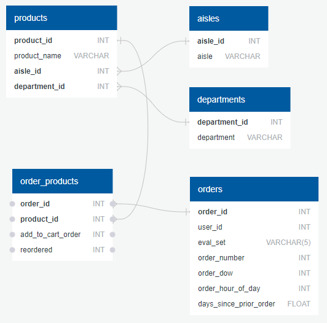

- `products`: contains product name and the assigned `aisle` and `department id`
- `aisles`: aisle name, a product sub-category under department
- `departments`: department name, product category
- `orders`: has info on customer, when order was placed and days since prior order
- `order_products`: stores info on what items were bought in each order, the order that item was added to cart, and if item has been ordered previously 

## 2. Exploratory Data Analysis
The dataset has over 49,000 products classified into 134 `aisles` and 21 `departments`. 
Theere were 206,200 unique users buying more than 33.8 million items in 3.4 million orders. See the full EDA notebook [here](./ExploratoryDataAnalysis/DataVisual.ipynb)

#### a. Customers usually bought 5 - 8 products per order
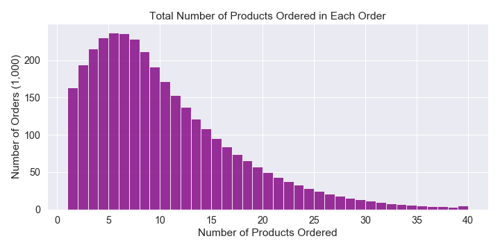

#### b. 1/3 of purchased products are produce, and mostly fresh fruits and fresh veges
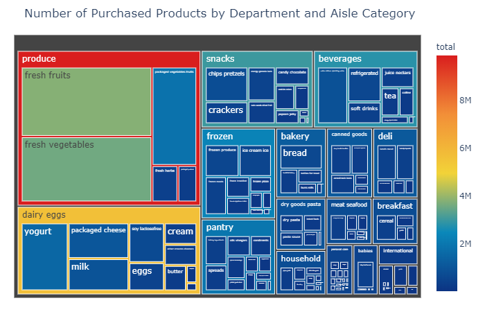

#### c. Bananas are everyone's favorite
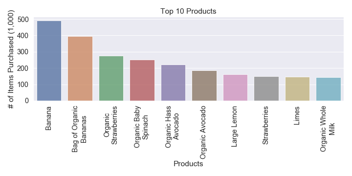

#### d. Daily food items are more often reordered
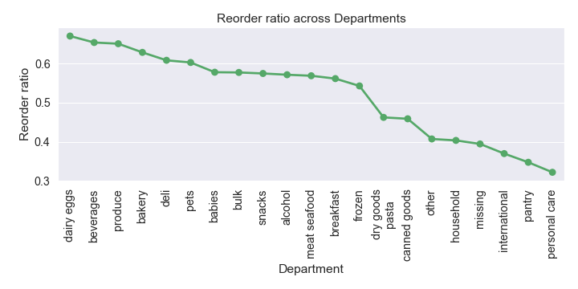

#### e. Most people placed orders at 3pm on Weekday 0 or 10am on Weekday 1
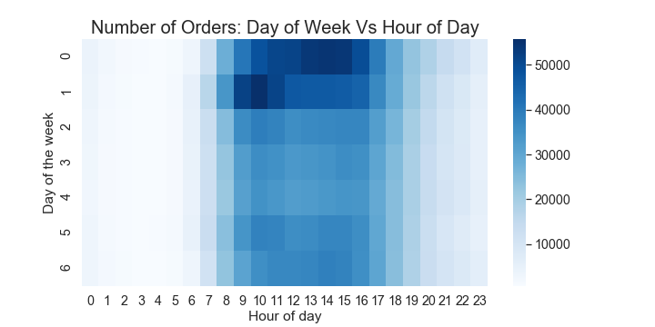

#### f. For frequent customers, they usually place order once a week
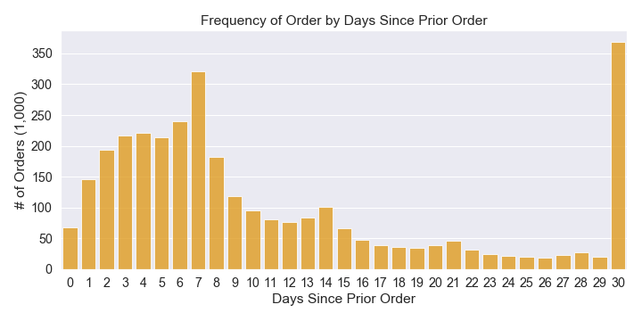

## 3. Customer Segmentation

We attempt to divide customers into groups based on their purchase history. The groups are then fed into the recommender system to tailor product recommendation for each target group. Because there is no pre-assigned group, we deploy unsupervised learning methods such as `K-means`, `DBSCAN` and `hierarichal clustering` to find underlying pattern and classify customers into groups.

#### a. Data Preprocessing
##### i. Order History for Each Customer
Data were aggregated by creating a purchase summary matrix for each customer. Rows represent each individual customer (`user_id`), columns represent product categories, and the resulting matrix is total number of products in each category. We have decided to aggregate purchases by both `department` and `aisle`, and an additional `organic` product category that was not classified in the original dataset. See the full data pareparation notebok [here](./CustomerSegmentation/0_DataPrep.ipynb)
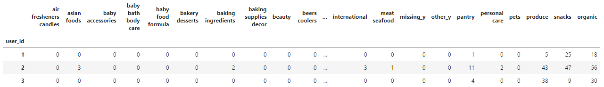

##### ii. Training Size: 20,000 were randomly selected from 90,000+ customers with over 100 products purchased

##### iii. Principal Component Analysis [(link to notebook)](./CustomerSegmentation/1_PCA.ipynb)
With 157 product categories and sub-categories (`department`, `aisle`, and `organic`), PCA reduced the number of dimensions to 71 while explaining 95% of the variance in data. 
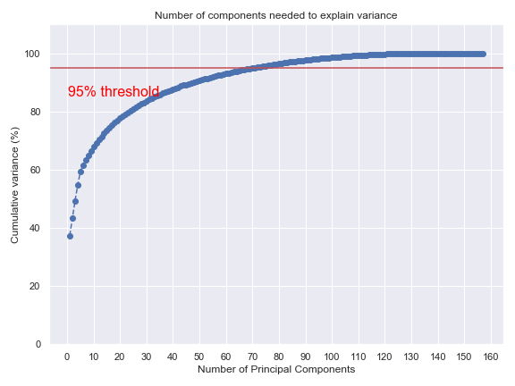

#### b. Clustering Methods
Three clustering methods were tested: `K-Means', `DBSCAN` and `Hierarichal Clustering`
##### 1. K-Means Clustering [(link to notebook)](./CustomerSegmentation/2_kmeans.ipynb)
  - Iterated with 2 to 20 clusters
  - Performance metrics such as inertia, Silhouette coefficient and Calinski-Harabasz score were calculated to help select the number of clusters. We decided the number is between 3 to 5.
  - We studided each cluster for any unique purchase pattern, and decided to pick 5 clusters.
  
| # | Name         | Description                                                                                |
|:-:| ------------ | ------------------------------------------------------------------------------------------ |
| 0 | The Majority | Most customers in this group, buying mostly fresh fruits and veges.                        |
| 1 | New Parents  | Buys mostly organic baby food; purchased 2 times the number of products than other groups. | 
| 2 | Family Guy   | Buys baby food too, but also on other categories                                           |
| 3 | The Drinkers | Mostly uses Instacart to buy beer and wine                                                 |
| 4 | The Packers  | Buys mostly packaged produce                                                               |

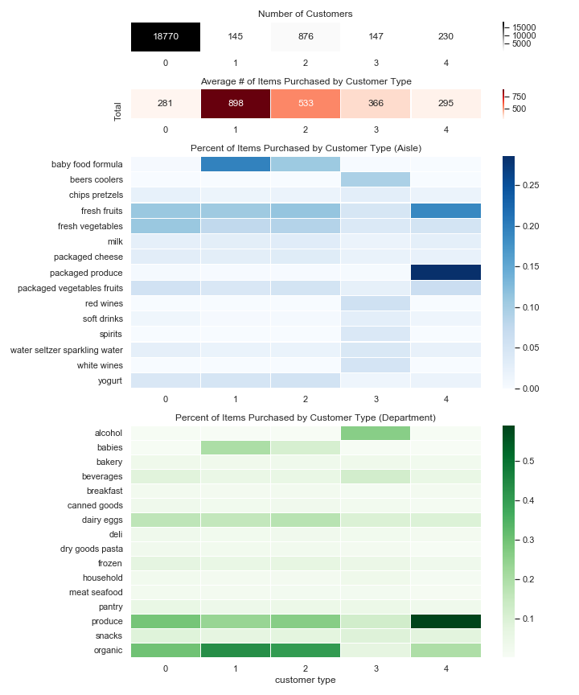
##### 2. DBSCAN [(link to notebook)](./CustomerSegmentation/3_DBSCAN.ipynb)
  - Key tuning parameters are `clustering radius` and `minimum sample size`. Data points not meeting the two thresholds are considered as outliers
  

  - Iterated the two parameters to get 5 clusters with as little outliers/noises (<1%) as possible 
  - DBSCAN seems to pick out the niche groups. These clusters have very few people.

| # | Name              | Description                                                        |
|:-:| ----------------- | ------------------------------------------------------------------ |
| -1| Outlier           | 82 customers in this group, seems to buy a bit of everything       |
| 0 | The Majority      | Most customers in this group, buying mostly fresh fruits and veges.|
| 1 | College Folks     | Bought a lot of frozen meals and energy bars                       | 
| 2 | Cat Owner Group 1 | Half of their purchase are in cat food care, followed by beverages |
| 3 | Organi-tarian     | Bought mostly organic produce                                      |
| 4 | Cat Owner Group 2 | Half of their purchase are in cat food care, followed by dairy eggs|

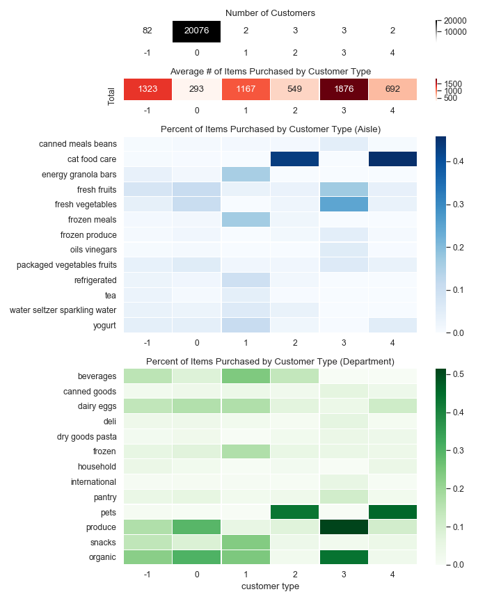
##### 3. Hierarchical Clustering [(link to notebook)](./CustomerSegmentation/4_Hierarchical%20Clustering.ipynb)
- In this case, we will use `Agglomerative Clustering` type within this clustering technique. In order to have a overview of the dataset, we are using dendrogram to viualize it

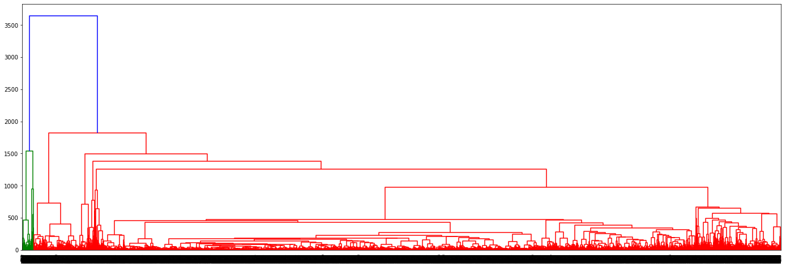

- To compare with K-mean, we will set cluster number as 5
- There are four popular methods under Agglomerative Clustering type. Each slightly different in rules in regards of how to cluster the datapoints. We tried each method and found `Ward` method provide the best clustering result
- Similar results as K-means 
  * one group with the majority of customers and another group buying mostly packaged produce
  * 3 intead of 2 groups buying baby food formula
  * the Drinkers group is gone
  
| Custome Group # | Top 5 Product Categories |
|:-:| -- |
| 0 | produce, dairy eggs, snacks, beverages, frozen |
| 1 | produce, `babies`, dairy eggs, snacks, beverages |
| 2 | produce, dairy eggs, snacks, frozen, `babies` |
| 3 | produce, dairy eggs, `babies`, snacks, frozen |
| 4 | `packaged produce`, dairy eggs, snacks, beverages, frozen |

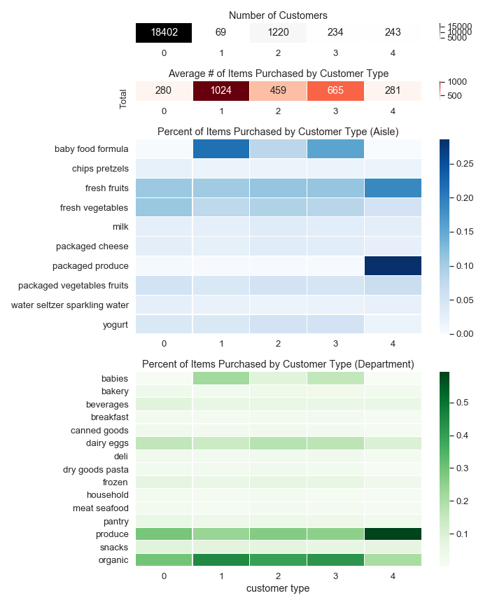

#### c. Results
- DBSCAN performed the worst, generating some clusters with very few customers. Because of its nature, it also leaves a bunch of customers as outliers and not being grouped.
- K-Means and Hierarchical Clustering performed similarly. We were able to identify specific purchase pattern for each customer group
- For a better comparison, we made the cluster number equals to 5 for both DBSCAN and Hierachical clustering method. However, these method could probably provide a better/different clustering results which might be more suitable for this dataset
- We settled with 5 clusters/groups from K-Means

## 4. Product Recommender / Market Basket Analysis

This section explores the customer purchasing habits by what they shop in the same order, and creates a product recommender. By looking at what customers of the same cluster bought, the recommender can provide a list of products that the target customer may be interested in buying.

`Global Recommendations` and `Association Rules` were examined. 

#### a. Global Recommendations [(link to notebook)](./Shopping%20Recommender/instacart%20recommender.ipynb)
This approach looks at all customer orders and identifies how many times two products were purchased together. For example, how many times a customer buys conditioner and shampoo at the same time. Result is a 49,000 x 49,000 product contingency matrix that shows the frequency of a product-pair was placed in the same order. Noted that this approach is based on all user data and not customer-specific. Because this approach relies on frequency, the results skew towards pairing with popular items (e.g. bananas, which is the most popular items in the dataset)

Below are examples of top 2 recommended items to buy along with bananas and organic baby spinach, respectively.

| Item | Recommended Items |
| ---- | :---------------- |
| bananas | organic avocado, organic strawberries |
| organic baby spinach | bag of organic bananas, banana |

#### b. Association Rules [(link to notebook)](./Shopping%20Recommender/association-rules-mining-market-basket-analysis.ipynb)
Association rule also looks into how buying one product (e.g. bread) would lead to buying another product(s) (e.g. peanut butter or jelly) in the same order. The meothd evaluates possible product pairs based on the following three metrics:
1. **support** defines the product popularity, based on the percentage of a product placed in an order
2. **confidence*** calculates the likelihood of buying item B when item A is added to cart, based on the percentage of orders with items A and B over orders with only item A
3. **lift** represents if adding item A in the cart would increase probability of buying item B. A value larger than 1 indicates that a customer would be more likely to buy item B if item A is in the cart. A value less than 1 indicates the opposite, meaning customer will be less likely to buy item B when they are buying item A (e.g. whole milk vs. 2% milk)

Below are examples of product pairs that have the highest support, confidence and lift, respectively. It appears that the high-scoring pairs are dominated by people buying different favors of the same product.

| Metric | Item A | Item B |
| ---- | :-- | :-- |
| Support | Yotoddler Organic Pear Spinach Mango Yogurt | Organic Whole Milk Strawberry Beet Berry Yogurt Pouch |
| Confidence | Unsweetened Blackberry Water | Unsweetened Pomegranate Essence Water |
| Lift | 0% Greek, Blueberry on the Bottom Yogurt | Nonfat Strawberry With Fruit On The Bottom Greek Yogurt |
| Honorable Mention | Compostable Forks | Plastic Spoons |

We also did the same analysis for each of the 5 customer groups. The resulting product pairs have higher average scores, and each customer group has their unique recommended pairs. For example, if **New Parents** customer adds `100% Sheep's Milk` to cart, the system would recommend `Chocolate Chip & Oatmeal Cookies`.

## 5. Example
`user_id` = 1
- belongs to `The Majority` customer group
- Top 3 recommended products after adding `Soda` to cart

| # | Item |
| -- | :- |
| 1 | Zero Calories Cola |
| 2 | Clementines |
| 3 | Bag of Organic Bananas |

## 6. Conclusion
In this project, we tested machine-learning algorithms on two important topics in retail business: **customer segmentation** and **market basket analysis**
- **customer segmentation**: we looked at their order history and applied unsupervised machine-learning methods were used to uncover differences among customers.
- **market basket analysis**: we looked at how products are bought in the same order and used association rule to discover relations among products and build product recommender.

